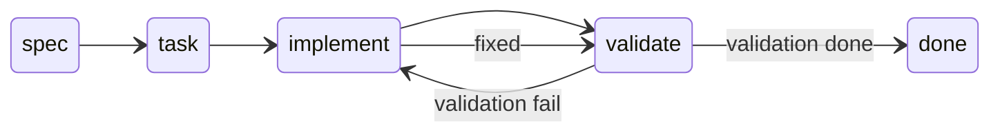

# emt-code-harness

Plantilla de workflow SDLC con agentes para **asistentes de código** (Cursor, Claude Code, Codex, Windsurf, etc.). Cada repositorio decide si la instala; no es global ni obligatoria.

## Instalación por proyecto (opt-in)

Desde este repositorio, apunta al proyecto destino:

```bash
# macOS / Linux
./install.sh /ruta/al/proyecto

# O desde la raíz del proyecto destino
/path/to/emt-code-harness/install.sh .

# Windows: Git Bash o WSL
bash install.sh C:/dev/mi-app
```

El script:

- Crea `.agents/agents/`, `.agents/artifacts/` y `.agents/artifacts/runs/` si no existen.
- Copia `pipeline-contract.md` + **5 agentes** a `.agents/agents/`.
- Copia `AGENTS.md` a la raíz (salvo con `--agents-only`).

```bash
./install.sh --agents-only /ruta/al/proyecto
./install.sh --help
```

### Configuración del agente (cualquier herramienta)

- **Solo `AGENTS.md` en instrucciones globales / siempre activas** del proyecto.
- Carga bajo demanda `pipeline-contract` y los agentes en `.agents/agents/` al delegar (subagente, @archivo, skill, etc.). No fijes todos los `.md` como reglas permanentes (~4k tokens menos por sesión).

Trabaja siempre en una rama de feature (`feature/<id>-<slug>`), nunca en `main`/`master` con el pipeline activo.

**Repos sin harness:** no ejecutes el instalador. El agente del IDE se comporta como siempre (solo contexto del repo).

**Actualizar el harness:** vuelve a ejecutar `install.sh` en el proyecto; los archivos del harness se sobrescriben, el resto en `.agents/` se conserva.

## Verificación rápida

1. Tras `install.sh .`, existen `pipeline-contract.md` + 5 agentes en `.agents/agents/`.
2. Un segundo `install.sh` actualiza los `.md` del harness sin borrar otros archivos en esas carpetas.
3. `AGENTS.md` en la raíz referencia `./.agents/agents/team-router.md`.

## Velocidad: diseño para no alargar sesiones

El pipeline completo (4 fases) es para **features medianas/grandes**. Para el día a día:

| Modo                  | Cuándo                                           | Qué pasa                                                                      |
| --------------------- | ------------------------------------------------ | ----------------------------------------------------------------------------- |
| **Tier 1**            | Preguntas, typos, cambios de 1 línea             | El gateway responde o edita **sin** subagentes ni artefactos.                 |
| **Fast path**         | Bugfix acotado, ≤3 archivos, sin deps ni schema  | SPEC + TASKS mínimos; validación solo en archivos tocados; máx. 2 bucles fix. |
| **Pipeline completo** | Feature nueva, refactor amplio, contratos/API/DB | Las 4 fases con artefactos completos.                                         |

Reglas de equipo para ir rápido:

- Pide explícitamente _"rápido"_ o _"solo X archivo"_ cuando aplique.
- No uses Tier 2 para tareas que caben en una respuesta directa (Tier 1).
- Commitea `runs/<name>/*.md` en el PR si aportan trazabilidad.

## Múltiples tareas con nombre (paralelo)

Puedes lanzar **varios agentes** a la vez (features distintas). Cada una tiene un **`name`** único y su propia carpeta:

```
.agents/scripts/           # pipeline-*.sh (estado/tareas vía CLI)
.agents/artifacts/
  REGISTRY.md              # Rebuild: pipeline-registry.sh
  runs/<name>/
    STATE.yaml             # phase, validation, fix_loop, awaiting_user
    <name>.md              # Spec (mismo slug que la tarea)
    <name>.tasks.md        # Tareas (mismo slug + .tasks.md)
    <name>.validation.md   # Requirement fit + Technical
```

**`REGISTRY.md`** — `pipeline-registry.sh` escanea `runs/*/STATE.yaml`.

**Scripts** — los agentes deben usar `.agents/scripts/` para actualizar estado y tareas (menos tokens y menos errores de formato). Ver [COMPLIANCE.md](COMPLIANCE.md).

**Reglas:**

- Gateway pasa `task: <slug>` al router.
- Agentes solo tocan `runs/<slug>/`; contrato compartido en `pipeline-contract.md`.
- `active:` en REGISTRY = tarea por defecto.

Ejemplo en paralelo: dos chats → `task: login-api` y `task: fix-footer` en handoffs separados.

## Flujo y estados (por tarea)

El `team-router` reconstruye **`REGISTRY.md`**, elige un `name`, y lee **`runs/<name>/STATE.yaml`**.

| Fase | Agente | `**phase:**` al terminar |
| ---- | ------ | ------------------------- |
| 1 | `spec-agent` | `task` |
| 2 | `task-agent` | `implement` |
| 3 | `implement-agent` | `validate` |
| 4 | `validate-agent` | Requirement fit + technical → `validation: done` o `fail` |

| `**validation:**` | Significado |
| ------------------ | ----------- |
| `pending` | Pendiente de validar |
| `done` | OK — esa tarea terminada |
| `fail` | Error — vuelve a implement si `fix_loop` < máx. (2 fast / 3 full) |



## Cuándo usar qué (gateway)

- **Explicaciones, documentación, dudas** → Tier 1.
- **Cambio pequeño acotado** → Fast path (router + artefactos mínimos).
- **Implementación difícil** (multi-archivo, feature, API/DB) → Pipeline **full** obligatorio: spec → task → implement → validate (validate puede volver a implement).
- Si falta información → el agente pregunta (`awaiting_user: true`); no asume.

## Artefactos y Git

- Rutas: `REGISTRY.md` + `runs/<name>/*` (commitear en PR si aporta trazabilidad).
- **Nueva tarea:** el router registra un `name` nuevo; no borra otras filas del registry.
- **Legacy:** `STATE.md` / artefactos planos en `artifacts/` → migrar a `runs/default/STATE.yaml`.

## Estructura

**Repo plantilla (emt-code-harness):**

```
install.sh             # Instalador
AGENTS.md              # Gateway (se copia al destino)
subagents/             # agentes (fuente install.sh)
scripts/               # pipeline-*.sh (fuente install.sh)
COMPLIANCE.md          # Checklist de cumplimiento
```

**Proyecto destino (tras install):**

```
AGENTS.md
.agents/
  agents/              # pipeline-contract + 5 agentes
  scripts/             # pipeline-init, state, spec, tasks, validation, registry
  artifacts/
    REGISTRY.md
    runs/<name>/       # STATE.yaml, <name>.md, <name>.tasks.md, ...
```

## Limitaciones

- Requiere un agente que lea `AGENTS.md` y pueda delegar a archivos en `.agents/agents/` (mecanismo depende del producto).
- En Windows nativo (CMD/PowerShell) usa Git Bash o WSL para `install.sh`.
- La fase de validación ejecuta comandos del proyecto (`lint`, `test`, etc.); no sustituye CI.
- La velocidad depende del tamaño del pedido: acota el scope en el prompt.
